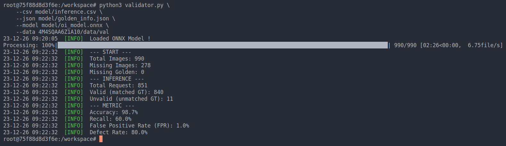

# sias-validator
A validator for siamese network and using my custom module `sias`.


## Pre-requirements
* Docker Engine

## Prepare Environment
Build and run the docker image
```bash
./docker/entry
```
## Convert TensorRT Engine
Using custom `TensorRT` build script, fix to `explicit batch`.
* Usage
    ```bash
    sias-cli build --onnx <path/to/onnx>
    ```
    *** Use `--help` to see more details. *** 

* Example:
    ```bash
    sias-cli build --onnx ./model/oi_model.onnx

    Completed parsing of ONNX file
    Building an engine from file ./model/oi_model.onnx; this may take a while...
    Completed creating Engine
    Generated Engine File: ./model/oi_model.engine

    Successed !
    ```

## Inference
Support `ONNX` and `TensorRT Engine`.
* Usage
    ```bash
    sias-cli run \
    --model <path/to/model, onnx or engine> \
    --inputs <path/to/sample>,<path/to/golden>
    ```
    *** Use `--help` to see more details. *** 

* Example:
    ```bash
    $ sias-cli run --model ./model/oi_model.engine --inputs ./data/sample/PASS/1.jpg,./data/golden/1.jpg 
    
    Running with model file: ./model/oi_model.engine
    Input files: ./data/sample/PASS/1.jpg, ./data/golden/1.jpg
    Result: 0.027741532772779465
    ```

## Validator
For innodisk user to verify the `TensorRT Engine` or the `ONNX Model` is work as well as TAO toolkit.
 
* File structure like below, (`dataset` and `model`)
    ```bash
    dataset/
    |-- data
    |   |-- dataset_convert
    |   |-- train
    |   `-- val
    `-- export
        `-- golden
    model
    |-- golden
    |-- golden_info.json
    |-- inference.csv
    |-- inference_info.json
    |-- oi_model.engine
    |-- oi_model.onnx
    `-- panel_info.json
    ```

* Usage
    ```bash
    python3 validator.py --csv <path/to/csv> --json <path/to/golden_info.json> --model <path/to/model>
    ```
    * Use `--help` to see more details. 
    * The log file will be generated in [logs/](./logs/).

* Example:
    ```bash
    python3 validator.py \
    --csv model/inference.csv \
    --json model/golden_info.json \
    --model model/oi_model.onnx \
    --data 4M4SQAA6Z1A10/data/val
    ```
    


# For Developer

## Install `sias`
Ensure the `src/sias` is in the same place. 
```bash
pip install -e .
```

## Convert
* Use `trtexec` 
    ```bash
    trtexec \
    --onnx=/workspace/model/oi_model.onnx \
    --saveEngine=/workspace/model/oi_model.engine
    ```

